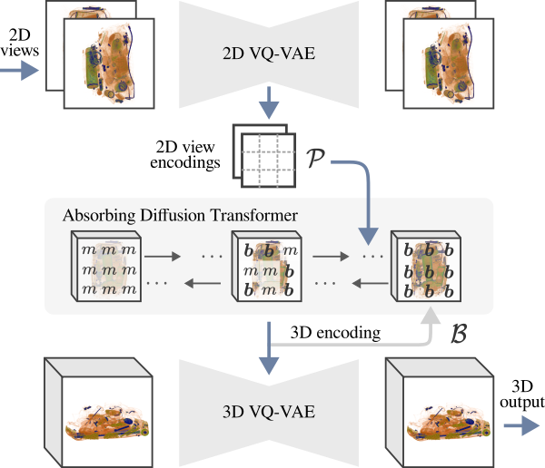

## Unaligned 2D to 3D Translation with Conditional Vector-Quantized Code Diffusion using Transformers

This is the official code for the ICCV 2023 paper [Unaligned 2D to 3D Translation](https://openaccess.thecvf.com/content/ICCV2023/html/Corona-Figueroa_Unaligned_2D_to_3D_Translation_with_Conditional_Vector-Quantized_Code_Diffusion_ICCV_2023_paper.html)


### Abstract
>   *Generating 3D images of complex objects conditionally from a few 2D views is a difficult synthesis problem, compounded by issues such as domain gap and geometric misalignment. For instance, a unified framework such as Generative Adversarial Networks cannot achieve this unless they explicitly define both a domain-invariant and geometric-invariant joint latent distribution, whereas Neural Radiance Fields are generally unable to handle both issues as they optimize at the pixel level. By contrast, we propose a simple and novel 2D to 3D synthesis approach based on conditional diffusion with vector-quantized codes. Operating in an information-rich code space enables high-resolution 3D synthesis via full-coverage attention across the views. Specifically, we generate the 3D codes (e.g. for CT images) conditional on previously generated 3D codes and the entire codebook of two 2D views (e.g. 2D X-rays). Qualitative and quantitative results demonstrate state-of-the-art performance over specialized methods across varied evaluation criteria, including fidelity metrics such as density, coverage, and distortion metrics for two complex volumetric imagery datasets from in real-world scenarios.*



[arXiv](https://arxiv.org/abs/2308.14152) | [BibTeX](#bibtex) | [Project Page](https://abrilcf.github.io/publications/CodeDiff3D)

### Table of Contents

- [Abstract](#abstract)
- [Table of Contents](#table-of-contents)
- [Setup](#setup)
  - [Set up conda environment](#set-up-conda-environment)
  - [Datasets](#datasets)
  - [Pre-Trained Models](#pre-trained-models)
- [Commands](#commands)
  - [Train the VQ-VAEs (Stage 1)](#train-stage-1)
  - [Train an Absorbing Diffusion sampler (Stage 2)](#train-stage-2)
- [Rendering 3D samples](#rendering-3d-samples)
- [Related Work](#related-work) 
- [BibTeX](#bibtex)

## Setup

Currently, a dedicated graphics card capable of running CUDA is required to run the code used in this repository. All models used for the paper were trained on a single NVIDIA A100 using CUDA version 11.7 and torch version 1.14.

### Set up conda environment

```
conda create --name codediff3d --file requirements.txt
conda activate codediff3d
```

Login to wandb with `wandb login`.

To train the diffusion model install flash attention from the instructions [here](https://github.com/HazyResearch/flash-attention). This requires access to nvcc, either installing cudnn through conda or activating the cuda module i.e. `module load cuda/11.7` should do this (using the version pytorch is compiled with).

## Datasets

We use the publicly available [LIDC-IDRI dataset](https://wiki.cancerimagingarchive.net/pages/viewpage.action?pageId=1966254) and preprocess the CT scans following the instructions in the [X2CT-GAN repo](https://github.com/kylekma/X2CT). We resample the voxel grids into a 128x128x128 resolution with a data type of float16 for fast loading. For the 2D projections we used Plastimatch and followed the instructions in the [MedNeRF repo](https://github.com/abrilcf/mednerf) setting a wider Hounsfield unit range of -1,000 HU to +1,000 HU.

We still have no plans for releasing the baggage security screening data. However this will be considered in the future.

### Pre-Trained Models
Pre-trained models can be found [here](https://drive.google.com/drive/folders/1VO6h86kevJmGUxpDB908QZdp1rBBlwEB?usp=sharing). To obtain all models, download the logs folder to the root directory of this repo.


### Train Stage 1

Train the 2D VQ-VAE with 
```
python train_xray_vqgan.py --config configs/default_xray_vqgan_config.py
```

Train the 3D VQ-VAE with
```
python train_ct_vqgan.py --config configs/default_ct_256_vqgan_config.py
```

### Train Stage 2

Train an Absorbing Diffusion sampler with 
```
python train_sampler.py --config configs/default_absorbing_config.py
```
By default this sets up the 2D and 3D VQ-VAEs with the above configs, other configs can be passed like in the following
```
python train_sampler.py --config configs/default_absorbing_config.py --ct_config=<path to config> --xray_config=<path to config>
```
with values overwritten as described below e.g. `--ct_config.model.codebook_size=2048`

### Configs
Default config files are passed to each trainer as above. Values can be overwritten like this
```
python train_xray_vqgan.py --config configs/default_xray_vqgan_config.py --config.run.wandb_mode=disabled --config.data.num_xrays=4
```

In particular, each config has the variable `config.run.experiment` which sets the folder to store logs/checkpoints in.

## Rendering 3D Samples

You can render samples like the ones found in the paper using the Exposure Renderer. We used the [Linux source](https://github.com/engineer1109/exposure-render-for-Linux). However it was originally build for [Windows here](https://github.com/ThomasKroes/exposure-render). The samples are saved in both 3DSlicer and Exposure Renderer formats from our code.

## Related Work

Our paper is heavily inspired from the following work:
- [Unleashing Transformers: Parallel Token Prediction with Discrete Absorbing Diffusion for Fast High-Resolution Image Generation from Vector-Quantized Codes](https://arxiv.org/abs/2111.12701)

## BibTeX

```
@InProceedings{Corona-Figueroa_2023_ICCV,
    author    = {Corona-Figueroa, Abril and Bond-Taylor, Sam and Bhowmik, Neelanjan and Gaus, Yona Falinie A. and Breckon, Toby P. and Shum, Hubert P. H. and Willcocks, Chris G.},
    title     = {Unaligned 2D to 3D Translation with Conditional Vector-Quantized Code Diffusion using Transformers},
    booktitle = {Proceedings of the IEEE/CVF International Conference on Computer Vision (ICCV)},
    month     = {October},
    year      = {2023},
    pages     = {14585-14594}
}
```
